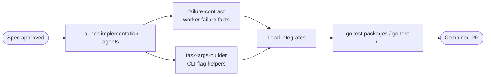

# Worker failure reporting architecture improvements

## Context
This spec reviews the architecture touched by the last week of changes in `oz-agent-worker` and proposes follow-up improvements. The relevant commits are:
- `36986a8721367de53a71f2aa4dcc4cb4abd6707e` — classified worker signal exits with failure metadata.
- `f10c5e381ad47298598a9e9ac2af5d46fe700d8a` — emitted `--computer-use` by default for Oz runs when `computer_use_enabled` is unset.

The current worker launch path is split across a common parameter-preparation layer, backend-specific execution, and worker-level reporting:
- [`internal/common/task_utils.go:17 @ f10c5e3`](https://github.com/warpdotdev/oz-agent-worker/blob/f10c5e381ad47298598a9e9ac2af5d46fe700d8a/internal/common/task_utils.go#L17) defines `TaskAugmentOptions`, and [`internal/common/task_utils.go:25-L156 @ f10c5e3`](https://github.com/warpdotdev/oz-agent-worker/blob/f10c5e381ad47298598a9e9ac2af5d46fe700d8a/internal/common/task_utils.go#L25-L156) derives the full set of Oz CLI flags from `Task.AgentConfigSnapshot`.
- [`internal/worker/backend.go:30-L107 @ f10c5e3`](https://github.com/warpdotdev/oz-agent-worker/blob/f10c5e381ad47298598a9e9ac2af5d46fe700d8a/internal/worker/backend.go#L30-L107) defines the backend interface and `TaskParams`, which isolates backends from WebSocket assignment wire details.
- [`internal/worker/backend.go:109-L151 @ f10c5e3`](https://github.com/warpdotdev/oz-agent-worker/blob/f10c5e381ad47298598a9e9ac2af5d46fe700d8a/internal/worker/backend.go#L109-L151) defines `TaskFailure`, a package-private structured error that carries metrics phase, metrics reason, and observed exit code.
- [`internal/worker/direct.go:247-L266 @ f10c5e3`](https://github.com/warpdotdev/oz-agent-worker/blob/f10c5e381ad47298598a9e9ac2af5d46fe700d8a/internal/worker/direct.go#L247-L266) normalizes direct subprocess signal exits to `128+signal`.
- [`internal/worker/docker.go:178-L187 @ f10c5e3`](https://github.com/warpdotdev/oz-agent-worker/blob/f10c5e381ad47298598a9e9ac2af5d46fe700d8a/internal/worker/docker.go#L178-L187) records Docker container exit codes and distinguishes OOM kills.
- [`internal/worker/kubernetes.go:85-L93 @ f10c5e3`](https://github.com/warpdotdev/oz-agent-worker/blob/f10c5e381ad47298598a9e9ac2af5d46fe700d8a/internal/worker/kubernetes.go#L85-L93) normalizes Kubernetes terminated-container signals, while [`internal/worker/kubernetes.go:643-L696 @ f10c5e3`](https://github.com/warpdotdev/oz-agent-worker/blob/f10c5e381ad47298598a9e9ac2af5d46fe700d8a/internal/worker/kubernetes.go#L643-L696) maps Pod/Job status into backend failures.
- [`internal/worker/errors.go:12-L50 @ f10c5e3`](https://github.com/warpdotdev/oz-agent-worker/blob/f10c5e381ad47298598a9e9ac2af5d46fe700d8a/internal/worker/errors.go#L12-L50) extracts task-failure labels and exit code from arbitrary errors.
- [`internal/worker/worker.go:610-L695 @ f10c5e3`](https://github.com/warpdotdev/oz-agent-worker/blob/f10c5e381ad47298598a9e9ac2af5d46fe700d8a/internal/worker/worker.go#L610-L695) handles terminal execution results, reclassifies SIGTERM during worker shutdown to `graceful_shutdown`, records metrics, and sends `task_failed`.
- [`internal/types/messages.go:88-L104 @ f10c5e3`](https://github.com/warpdotdev/oz-agent-worker/blob/f10c5e381ad47298598a9e9ac2af5d46fe700d8a/internal/types/messages.go#L88-L104) serializes `failure_reason` and `exit_code` to warp-server.
- [`internal/metrics/metrics.go:103-L150 @ f10c5e3`](https://github.com/warpdotdev/oz-agent-worker/blob/f10c5e381ad47298598a9e9ac2af5d46fe700d8a/internal/metrics/metrics.go#L103-L150) owns the bounded failure reason enum and notes that warp-server mirrors those values.

The current architecture is directionally good: backends no longer return only opaque errors, and the worker keeps lifecycle context such as user cancellation versus shutdown. The remaining weakness is that failure classification is an implicit convention spread across several files. A new failure reason requires touching metrics enums, backend call sites, worker reporting logic, warp-server mirrors, and tests without one local contract that explains the end-to-end invariant.

## Proposed changes
Introduce a small internal failure-classification boundary and move command-argument derivation into composable helpers. This is intentionally a refactor/architecture hardening proposal, not a behavior rewrite.

1. Add `internal/worker/failure.go` as the single public-in-package contract for terminal failure facts.
   - Define a `FailureFacts` struct with `Phase`, `Reason`, `ExitCode`, `UserMessage`, and `Cause`.
   - Replace the private fields on `TaskFailure` with a `Facts() FailureFacts` method so backends can construct failures without exposing mutable labels.
   - Move `taskFailureLabels`, `failureExitCode`, `userFacingTaskError`, and graceful-shutdown reclassification behind one function, for example `classifyTaskFailure(err error, source taskCancellationSource) FailureFacts`.
   - Keep backend construction helpers package-private, but make their names describe the facts they record: `backendFailure(...)` and `backendFailureWithExit(...)`.

2. Centralize exit-code normalization.
   - Move `agentExitCode` and `terminatedExitCode` into a shared helper, for example `normalizedExitCodeFromWaitStatus` and `normalizedExitCodeFromKubernetesTermination`.
   - Document that Docker already reports signal-coded status codes and should pass them through unchanged.
   - Add table tests covering direct subprocess exit, direct signal exit, Docker `137`/`143`, Kubernetes `ExitCode`, Kubernetes `Signal`, and no observed process status.

3. Make the worker reporting path consume `FailureFacts`.
   - In `executeTask`, replace the separate `taskFailureLabels`, `failureExitCode`, graceful-shutdown branch, `userFacingTaskError`, metrics labels, span status, and `task_failed` message arguments with one `facts := classifyTaskFailure(err, w.cancellationSource(taskID))`.
   - Use `facts.Reason` for metrics, span status, and `TaskFailedMessage.FailureReason`.
   - Use `facts.ExitCode` for `TaskFailedMessage.ExitCode`.
   - Use `facts.UserMessage` for the user-visible failure message.
   - Preserve the existing special case where user-requested cancellation sends a cancelled completion message rather than `task_failed`.

4. Split `AugmentArgsForTask` into option-specific emitters while preserving flag order.
   - Keep `AugmentArgsForTask` as the stable entry point.
   - Add focused helpers such as `appendModelArgs`, `appendHarnessArgs`, `appendComputerUseArgs`, `appendInferenceProviderArgs`, `appendSessionSharingArgs`, `appendSnapshotArgs`, `appendEnvironmentArgs`, and `appendIdleArgs`.
   - Add one top-level order-preservation test that protects the current CLI flag order, plus narrower tests for each helper’s behavior.
   - This reduces review risk for future snapshot-derived flags because reviewers can reason about one flag family at a time.

5. Add a cross-repo contract checklist for failure reasons.
   - Keep the enum in `internal/metrics` for metrics priming, but add a short comment block or test fixture listing the mirrored warp-server enum path.
   - Prefer a unit test that verifies every `TaskFailureReason` appears in the package’s primed list. If warp-server generated types are not available in this repo, keep the cross-repo check as a documented release checklist rather than adding brittle network-time validation.

### Tradeoffs
Keeping failure facts inside `internal/worker` avoids creating a new top-level package and keeps backend details close to the worker. Moving the enum out of `metrics` would make the domain boundary cleaner, but it is a larger churn because `metrics.Init` primes bounded series from the same constants. This proposal keeps the enum stable and improves the classification seam around it.

## Testing and validation
- Run `go test ./internal/worker ./internal/common ./internal/metrics` as the primary validation set for the touched packages.
- Add `TestClassifyTaskFailure` table coverage:
  - plain context deadline maps to `task_timeout`.
  - plain context cancellation maps to `task_cancelled`.
  - backend image-pull failure preserves `image_pull`.
  - backend SIGTERM exit with shutdown source maps to `graceful_shutdown`.
  - backend SIGTERM exit without shutdown source preserves the backend reason and exit code.
  - unknown errors map to `unknown` and retain a safe user-facing message.
- Add `TestNormalizeExitCode` table coverage for direct, Docker, and Kubernetes paths.
- Keep `TestTaskFailedMessageIncludesFailureFacts` and update it to consume `FailureFacts` through the worker reporting path rather than manually passing reason and exit code when practical.
- Add `TestAugmentArgsForTaskFlagOrder` to pin the combined CLI output for a representative task snapshot with model, profile, skill, MCP, computer use, Bedrock, harness, session sharing, snapshot, environment, additional args, and idle timeout.
- Run full `go test ./...` before merging if local Docker/Kubernetes tests are not environment-dependent; otherwise run package-scoped tests plus any repository-documented CI target.

## Parallelization
Parallel sub-agents would help if this refactor is implemented after spec approval because the two workstreams touch different packages.

- `failure-contract` — owns `internal/worker/backend.go`, `internal/worker/errors.go`, backend failure call sites, and worker reporting tests. Run locally in worktree `/workspace/oz-agent-worker-failure-contract` on branch `oz/worker-failure-contract`, then return a patch for lead integration.
- `task-args-builder` — owns `internal/common/task_utils.go` and `internal/common/task_utils_test.go`. Run locally in worktree `/workspace/oz-agent-worker-task-args-builder` on branch `oz/task-args-builder`, then return a patch for lead integration.

Sequential integration should happen after both agents finish:
1. Lead reviews and merges `failure-contract` first because it changes worker-level terminology.
2. Lead merges `task-args-builder` second because it should be behavior-preserving and isolated.
3. Lead runs package-scoped tests, then `go test ./...` if available in the environment.
4. Land as one combined PR so reviewers can see the architecture cleanup and the behavior-preserving helper split together.

## Risks and mitigations
- **Metrics label drift**: changing enum ownership could break dashboards. Mitigation: keep enum values unchanged in `internal/metrics` and only change how facts are assembled.
- **Server compatibility drift**: `failure_reason` values are mirrored in warp-server. Mitigation: do not add or rename reasons in this refactor; add a release checklist for future reason changes.
- **Behavior drift in CLI flags**: splitting `AugmentArgsForTask` can accidentally reorder flags or change defaults. Mitigation: preserve `AugmentArgsForTask` as the entry point and add an order-preservation fixture before refactoring.
- **Backend-specific nuance loss**: Docker and Kubernetes expose different failure signals. Mitigation: keep backend-specific observation code near each backend, but normalize into `FailureFacts` immediately after observation.

## Follow-ups
- Consider adding a small generated markdown reference of worker failure reasons for operators after the classification contract is stable.
- If warp-server later exposes generated client/server types for worker failure reasons, add a CI check that compares worker enum values to the server enum rather than relying on comments.
